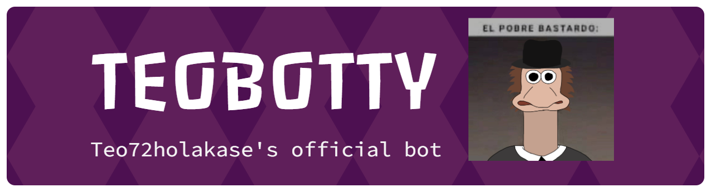

# 🤖 TeoBotty

Bot modular de Discord con soporte de tickets, roles, sugerencias, votaciones, embeds interactivos y keep-alive.

## ✨ Qué hace

- Gestiona tickets con tipos avanzados y paneles de selección.
- Aplica autoroles y reaction roles automáticamente.
- Envía mensajes de bienvenida y despedida configurables.
- Responde a palabras clave con triggers automáticos.
- Permite sugerencias y votaciones en Discord.
- Crea embeds con editor interactivo.
- Mantiene vivo el bot con reacciones periódicas.
- Guarda datos en SQLite.

## 🚀 Instalación rápida

1. Activa un entorno virtual:
   ```powershell
   python -m venv .venv
   .venv\Scripts\Activate.ps1
   ```
2. Instala dependencias:
   ```powershell
   pip install -r requirements.txt
   ```
3. Crea un archivo `.env` con la configuración mínima.
4. Ejecuta el bot:
   ```powershell
   python main.py
   ```

## ⚙️ Configuración

### Variables obligatorias

Crea `.env` con estas variables:

```env
DISCORD_TOKEN=tu_token_real_aqui
DATABASE_PATH=./bot_data.db
```

### Variables opcionales

```env
KEEP_ALIVE_GUILD_ID=123456789
KEEP_ALIVE_CHANNEL_ID=987654321
```

- `DISCORD_TOKEN`: Token del bot de Discord. Obligatorio.
- `DATABASE_PATH`: Ruta del archivo SQLite.
- `KEEP_ALIVE_GUILD_ID`: ID del servidor para la función keep-alive.
- `KEEP_ALIVE_CHANNEL_ID`: ID del canal donde el bot reaccionará cada 20 minutos.

> Si no configuras `KEEP_ALIVE_*`, la tarea seguirá activa pero solo escribirá logs.

## 📌 Variables de plantilla disponibles

Estas variables están disponibles en los mensajes personalizados:

- `{user}`: menciona al usuario (`<@ID>`).
- `{username}`: nombre de usuario sin mención.
- `{guild}`: nombre del servidor.
- `{message}`: contenido del mensaje original (para triggers).

## 📚 Comandos detallados

### 🎉 Bienvenida y despedida

- `/set_welcome channel message`
  - `channel`: canal de texto donde se enviará el mensaje.
  - `message`: texto personalizado con variables.
  - Ejemplo: `/set_welcome #bienvenida ¡Bienvenido {user} a {guild}!`

- `/set_farewell channel message`
  - Igual que `/set_welcome`, pero para despedidas.
  - Ejemplo: `/set_farewell #despedidas {username} se ha ido del servidor.`

- `/test_welcome`
  - Envía el mensaje de bienvenida configurado al canal actual.

### 🔐 Roles y autoroles

- `/add_autorole role`
  - `role`: el rol que se asignará automáticamente a nuevos miembros.

- `/remove_autorole role`
  - Elimina un autorol existente.

- `/list_autoroles`
  - Muestra todos los autoroles configurados para el servidor.

- `/add_reaction_role message_id emoji role`
  - `message_id`: ID del mensaje donde se debe reaccionar.
  - `emoji`: emoji que el usuario utilizará para recibir el rol.
  - `role`: rol que se asignará al reaccionar.
  - Nota: el mensaje debe existir en el canal donde ejecutas el comando.

- `/remove_reaction_role message_id emoji`
  - Elimina la configuración de reaction role para ese mensaje y emoji.

### 🎯 Triggers automáticos

- `/add_trigger keyword response`
  - `keyword`: palabra clave que activará la respuesta.
  - `response`: texto que el bot enviará cuando detecte la palabra.
  - Variables disponibles: `{user}`, `{username}`, `{message}`.
  - Ejemplo: `/add_trigger hola ¡Hola {user}, bienvenido!`

- `/remove_trigger keyword`
  - Elimina un trigger por palabra clave.

- `/list_triggers`
  - Muestra la lista de triggers activos en el servidor.

### 🎫 Tickets avanzados

- `/create_ticket_type name mention_roles close_permissions log_channel category`
  - `name`: nombre del tipo de ticket.
  - `mention_roles`: IDs de roles a mencionar, separadas por comas.
  - `close_permissions`: IDs de roles que pueden cerrar el ticket.
  - `log_channel`: canal donde se guardarán logs.
  - `category`: categoría de texto donde se crearán los tickets.
  - Ejemplo: `/create_ticket_type Soporte 123456789,987654321 123456789 #ticket-logs Tickets`

- `/list_ticket_types`
  - Lista todos los tipos de ticket configurados con sus permisos.

- `/delete_ticket_type ticket_type_id`
  - Elimina un tipo de ticket por su ID.

- `/create_ticket_panel channel title description color image`
  - `channel`: canal donde se publicará el panel.
  - `title`: título del embed de panel.
  - `description`: descripción explicativa.
  - `color`: color en formato `#RRGGBB`.
  - `image`: URL de imagen opcional.
  - Este comando crea el embed base del panel.

- `/configure_ticket_panel selection_type ticket_config`
  - `selection_type`: `emoji`, `button` o `list`.
  - `ticket_config`: configuración de opciones según el tipo.

  Formatos:
  - `emoji`: `ID:emoji,ID:emoji,...`
    - Ejemplo: `1:🎫,2:📋`
  - `button`: `ID:emoji:text:color,ID:emoji:text:color,...`
    - Ejemplo: `1:🎫:Soporte:primary,2:📋:Reportar:secondary`
  - `list`: `ID:posición:emoji:texto,ID:posición:emoji:texto,...`
    - Ejemplo: `1:1:🎫:Soporte,2:2:📋:Reportes`

### 💡 Sugerencias y votaciones

- `/set_suggestions channel`
  - Configura un canal para convertir mensajes en sugerencias.
  - Cada mensaje enviado en ese canal se transforma en embed de sugerencia.

- `/unset_suggestions`
  - Quita el canal configurado de sugerencias.

- `/create_poll question options everyone image1 image2 image3`
  - `question`: texto de la votación.
  - `options`: opciones separadas por `;`.
  - `everyone`: `true` o `false` para mencionar `@everyone`.
  - `image1`, `image2`, `image3`: adjuntos opcionales.
  - Ejemplo: `/create_poll "¿Cuál color?" "Rojo;Azul;Verde" false`

### ℹ️ Información

- `/userinfo user`
  - `user`: usuario opcional.
  - Muestra datos de la cuenta, roles, fecha de unión y más.

- `/serverinfo`
  - Muestra datos del servidor: miembros, canales, roles, boosts y características.

### 🎉 Diversión

- `/dice`
  - Lanza un dado de 1 a 6.

- `/coin`
  - Lanza una moneda (Cara / Cruz).

- `/rps choice`
  - Juega piedra, papel o tijeras.
  - `choice`: `piedra`, `papel` o `tijeras`.

- `/8ball question`
  - Pregunta a la bola mágica.

- `/quote`
  - Devuelve una cita motivacional aleatoria.

- `/roulette`
  - Ruleta rusa de diversión.

- `/hug user`
  - Envía un abrazo a otro usuario.

- `/rate target`
  - Califica cualquier cosa del 1 al 10.

- `/choose options`
  - Elige entre opciones separadas por comas.
  - Ejemplo: `/choose pizza, hamburguesa, tacos`

### 🎨 Creador de embeds

- `/create_embed`
  - Abre un editor interactivo para construir embeds.
  - Permite editar título, descripción, color, autor, imagen, footer y campos.
  - Después de crear, puedes enviar el embed a un canal.

### ⏰ Keep-Alive

- `/set_keep_alive channel`
  - Configura el canal donde se reaccionará cada 20 minutos.
  - Complementa la configuración agregando `KEEP_ALIVE_GUILD_ID` y `KEEP_ALIVE_CHANNEL_ID` en `.env`.
  - Esto ayuda a prevenir que el host detenga el bot por inactividad.

## 📁 Estructura del proyecto

```
teobot/
├── main.py
├── database.py
├── verificar.py
├── requirements.txt
├── Procfile
├── README.md
├── .env
├── github-header-banner.png
└── cogs/
    ├── __init__.py
    ├── tickets.py
    ├── roles.py
    ├── welcome.py
    ├── triggers.py
    ├── fun.py
    ├── social.py
    ├── info.py
    ├── keep_alive.py
    └── embed_creator.py
```

## 🛠️ Problemas comunes

- `ModuleNotFoundError: No module named 'discord'`
  - Ejecuta `pip install -r requirements.txt`.

- `DISCORD_TOKEN not found`
  - Revisa que `.env` contenga `DISCORD_TOKEN`.

- Comandos no aparecen
  - Espera un par de minutos, reinicia Discord y revisa permisos.

- El bot no responde
  - Ejecuta `python main.py` y revisa la consola.

## 📝 Notas finales

- El bot usa **slash commands** (`/`) y no requiere prefijo clásico.
- Recuerda usar IDs en `mention_roles` y `close_permissions` cuando configures tipos de ticket.
- Los cambios de configuración se aplican tras reiniciar el bot si modificas `.env`.

## 📄 Licencia

Proyecto de uso personal. Puedes adaptar el código a tus necesidades.
